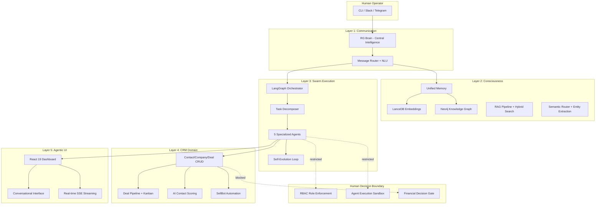

# RG — AI-Native Business Operations Platform

> One person. The cognitive capacity of a ten-person team.

RG is an autonomous agent system that replaces traditional business operations tooling with AI-native workflows. Instead of layering AI onto legacy CRM, knowledge management, and development tools, RG redesigns the entire operating layer from scratch — consciousness, execution, and decision-making built for the AI era.

**Built by Ravi Gandhi Arul** | Python 3.12 | Claude Code + LangGraph + LanceDB + Neo4j

---

## Architecture



## Quick Start

```bash
# 1. Clone and install
git clone https://github.com/ravigandhiarul-agent/rg-ai-native-ops.git
cd rg-ai-native-ops && pip install -r requirements.txt

# 2. Start services and seed data
make up && python scripts/seed_crm.py

# 3. Launch
python rg.py start
```

## What It Does

| Capability | Traditional Approach | RG AI-Native Approach |
|-----------|---------------------|----------------------|
| **CRM** | Manual data entry, separate tool | AI-scored contacts, auto-pipeline, consciousness-linked |
| **Knowledge** | Scattered docs, tribal knowledge | Hybrid RAG (vector + graph + keyword), compounding memory |
| **Development** | Human writes all code | Autonomous agents: code to test to PR, learns from failures |
| **Operations** | Queue-based, FIFO | NLU-routed, priority-scored, parallel execution |
| **Improvement** | Periodic reviews | Continuous evolution: outcome grading, reflexion, prompt A/B testing |

## Where AI Stops

**Financial commitment decisions remain human.** Deal approvals, pricing, and monetary obligations are enforced by RBAC role boundaries and an execution sandbox that blocks agent financial transactions at the code level. In regulated fintech, fiduciary duty (CIRO/OSC) requires named human accountability.

## Tech Stack

`Python 3.12` · `Claude Code CLI (Max)` · `LangGraph` · `LanceDB` · `Neo4j` · `Ollama` · `FastAPI` · `React 19` · `Tailwind CSS` · `Prometheus` · `Grafana` · `Docker`

## System Stats

- **27,500+** lines of Python
- **5** specialized agents (developer, researcher, marketer, reviewer, CRM builder)
- **16** architectural layers
- **88%** test pass rate (130+ test modules)
- **44/50** CRM tests passing
- **12** CRM views (contact table, Kanban, analytics, etc.)

---

*Submitted for Wealthsimple AI Builder role — March 2026*
