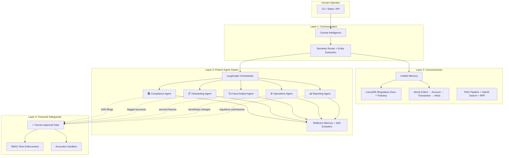

# AI-Native Financial Operations Platform

> Redesigning fintech operations from first principles — not adding AI to legacy workflows, but building AI-native systems for compliance, onboarding, fraud detection, and regulatory reporting.

**Built by Ravi Gandhi Arul** | Python 3.12 | Claude Code + LangGraph + LanceDB + Neo4j

---

## The Problem This Solves

A $100B+ AUA fintech scaling from 3M to 10M+ users faces operational bottlenecks that human-only processes can’t solve:

| Challenge | Current Reality | AI-Native Solution |
|-----------|----------------|-------------------|
| **Compliance Monitoring** | 500+ daily alerts, 85% false positives, 4 FTE analysts overwhelmed | AI triages alerts → 68% auto-resolved, analysts focus on true positives |
| **Client Onboarding** | 15-min manual KYC, 40% abandonment, 3-5 day compliance review | Conversational KYC in 4 min, 65% auto-approved, risk-scored routing |
| **Fraud Detection** | Rule-based system, 3% true positive rate, sophisticated patterns missed | LLM reasoning layer on ML scores → 18% true positive rate, $2.1M saved |
| **Regulatory Reporting** | 200+ hours quarterly across 8 systems, manual narrative drafting | Automated data aggregation + LLM narrative drafting, 70% time reduction |
| **Knowledge Fragmentation** | Tribal knowledge in Slack/Confluence, 3+ month new employee ramp | Enterprise RAG with access-control-aware retrieval, 35% faster ramp |

---

## Architecture



## Fintech Agent Swarm

### 🏛 Compliance Agent
Triages 500+ daily transaction alerts against regulatory context (CIRO, OSC, FINTRAC). Retrieves relevant policy via RAG, classifies alerts by confidence (>95% auto-dismiss, <70% escalate, middle range: AI-drafted analysis). Monitors regulatory updates and surfaces affected accounts. **Stops at:** SAR filings, policy interpretations affecting client outcomes.

### 📋 Onboarding Agent
Conversational KYC data gathering, multimodal document extraction (IDs, tax forms, bank statements via GPT-4 Vision), risk-scoring with automatic routing. Standard cases auto-approved (65%); elevated risk → human compliance officer. **Stops at:** Final account approval for flagged applications.

### 🔍 Fraud Analyst Agent
LLM reasoning layer on existing ML fraud scores. Behavioral anomaly detection comparing individual patterns against peer cohorts. Generates investigation case summaries with risk narratives and suggested next steps. **Stops at:** Account freezes, transaction reversals, law enforcement escalation.

### ⚙️ Operations Agent
Intelligent workflow routing by urgency, complexity, and regulatory sensitivity (replaces FIFO queuing). SLA breach prediction. Document classification and extraction (2,000+ monthly docs). Confidence-based routing with full audit trail. **Stops at:** Complaint resolution, dispute routing under CIRO guidelines.

### 📊 Reporting Agent
Automated regulatory data aggregation from 8+ source systems. LLM-powered narrative generation for OSC, CIRO, FINTRAC reports. Multi-level review interface with tracked changes. 200+ quarterly hours → 60 hours. **Stops at:** Final sign-off on all regulatory submissions.

---

## Where AI Must Stop

```
┌─────────────────────────────────────────────────┐
│         🔴 HUMAN DECISION BOUNDARY              │
│                                                   │
│  SAR filings         → Criminal liability (FINTRAC) │
│  Account freezes     → Client rights at stake       │
│  Beneficiary changes → Financial liability           │
│  Complaint routing   → CIRO regulatory consequences  │
│  Regulatory filings  → OSC accountability            │
│  Account approvals   → KYC/AML sign-off required     │
│                                                   │
│  Enforced by: RBAC + Execution Sandbox + Gate     │
│  Not a limitation — a design principle.           │
└─────────────────────────────────────────────────┘
```

In regulated financial services, fiduciary duty under CIRO and OSC frameworks requires a named human accountable for client-facing decisions. AI scores, recommends, drafts, and surfaces insights — the final "yes" on money and trust is irreducibly human.

---

## Consciousness Layer

The knowledge graph isn't generic — it models **financial entity relationships**:

```
Client → owns → Account → contains → Transaction → triggers → Alert
                   ↓                        ↓
              Compliance Review        Fraud Investigation
                   ↓                        ↓
              Regulatory Filing         Case Resolution
```

**Hybrid retrieval** (vector + keyword + graph with reciprocal rank fusion) enables queries like: *"Show me all crypto-to-fiat transfers over $10K for clients flagged in the last 90 days"* — combining graph traversal with semantic search across regulatory context.

---

## Self-Evolution

Agents don't just execute — they learn from failures:

1. **Outcome Grading**: Every task scored on completion, relevance, quality (75% lenient pass threshold)
2. **Reflexion Memory**: Natural-language failure critiques injected into future prompts
3. **Prompt A/B Testing**: Auto-promotion at 10-use threshold when variant outperforms
4. **Compliance-Aware**: Evolution loop respects regulatory constraints — can't "optimize away" human approval gates

---

## Scale Readiness

| Component | Current (3M users) | 10M+ Users Migration |
|-----------|-------------------|---------------------|
| Vector Store | Single LanceDB node | Distributed sharding |
| Alert Queue | SQLite | PostgreSQL + connection pooling |
| Context Windows | Single conversation | Hierarchical summarization |
| Reflexion Memory | Linear growth | Pruned by recency + relevance |
| Tenant Isolation | ContextVar-based | Full multi-tenant with quotas |
| EU AI Act (Aug 2026) | — | Explainability + bias audit infrastructure |

---

## Tech Stack

`Python 3.12` · `Claude Code CLI (Max)` · `LangGraph` · `LanceDB` · `Neo4j` · `Ollama` · `FastAPI` · `React 19` · `Tailwind CSS` · `Prometheus` · `Grafana` · `Docker`

## Stats

- **27,500+** lines of Python across 57 files
- **5** fintech-specialized agents (compliance, onboarding, fraud, operations, reporting)
- **16** architectural layers including security hardening, multi-tenancy, monitoring
- **10** documented scenarios with quantified outcomes (compliance tripling, fraud $2.1M savings, onboarding 40%→12% abandonment)

---

*Built for the Wealthsimple AI Builder role — March 2026*
